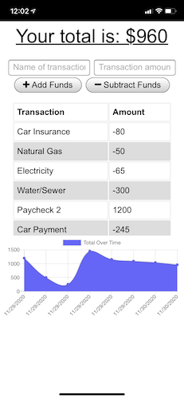

# Homework 18: Progressive Budget

## Description
This repository holds the homework assignment for Week 18 of the [The Coding Boot Camp](https://techbootcamps.utexas.edu/coding/) through the University of Texas at Austin's Center for Professional Education.

The scope of this project is to create a Budget Tracker application that has been developed as a progressive web app that will allow for for offline access and functionality. 

## Notes
<!-- This application uses the following Node.js packages:
- [express](https://expressjs.com/)
- [mongoose](https://www.npmjs.com/package/mongoose)
- [morgan](https://www.npmjs.com/package/morgan)
- [compression](https://www.npmjs.com/package/compression) -->

## Instructions
This project is deployed on Heroku [here](https://rr-budget-pwa.herokuapp.com/).

## Page Screenshots
Installed app on MacOS:

Installed app on iOS:

    

## Contributing
Any and all collaboration is welcome so if you have any suggestions or thoughts for new features, please send me an email at ryan.rotman@gmail.com.